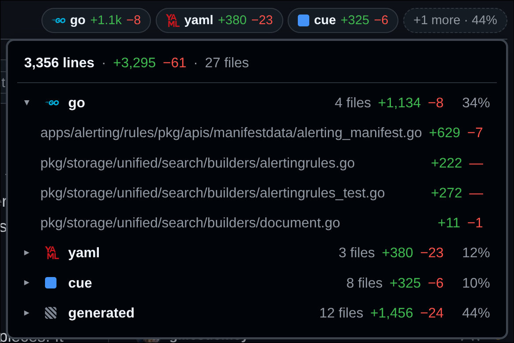

# PR Diff Breakdown

A Chrome extension that breaks a GitHub pull request's `+/−` line count down by
file type, right next to the number GitHub already shows.

The problem it solves: a PR reads **+1,346 −2,371** and everyone decides to
review it later. In reality the Python change is 8 added and 7 removed lines and
the rest is a re-recorded test cassette. That is a five-minute review wearing a
two-hour costume.


The chips are always shown — no hover, no expanding — and GitHub's own
`+1,346 −2,371` and five squares are hidden, because the chips replace them.

Well-known extensions get their real icon; anything else gets a colored square,
striped for `generated` / `vendored` / `binary`. Those striped buckets always
sort last and are the first to be dropped when the header runs out of room —
you should see the code before the noise. Because GitHub's own total is hidden,
the `+N more` chip then reports how much of the diff went with it
(`+1 more · 44%`), so the chips never understate the size of a mostly-generated
PR. Counts are shortened by default (`numbers: full` for exact). Clicking any
chip opens the per-file breakdown:



Every bucket expands. One that holds several extensions shows its extension mix
(`generated → yaml 1,338/2,364`); one that is already a single extension lists
the files, each linking straight to that file's diff. The detail view always
shows exact numbers.

## Install

Not on the Web Store yet. To run it locally:

1. `chrome://extensions` → enable **Developer mode**
2. **Load unpacked** → pick this directory
3. Open any pull request

## Configuration

Configuration is **optional**. With nothing set up at all, files are grouped by
extension, which already separates the Python from the YAML. Four layers refine
that, and each one is worth having on its own.

Resolution is **per file, not per layer**: every file walks the list below and
the first match wins. Adding one local rule reclassifies the files it names and
leaves everything else on your team's config.

| Precedence | Source | What it's for |
|---|---|---|
| 1 (highest) | Your overrides (extension options) | Personal buckets, on any repo |
| 2 | `.github/pr-diff-breakdown.yml` in the repo | Shared vocabulary, checked in and reviewable |
| 3 | `.gitattributes` | Config most repos already have |
| 4 (fallback) | File extension | Always matches; needs no setup |

### Layer 3 is free — use it first

If a repo marks paths as generated:

```gitattributes
tests/cassettes/** linguist-generated=true
```

…GitHub itself already collapses those diffs by default, for everyone, with no
extension installed. This extension just picks up the same signal and labels the
bucket `generated`. If your team isn't doing this yet, it's the cheapest win
available and it helps people who never install anything.

Recognised: `linguist-generated`, `linguist-vendored`, `linguist-documentation`,
and the `binary` / `-diff` markers.

### Layer 2: the repo file

`.github/pr-diff-breakdown.yml` is what splits files that share an extension —
cassette YAML from CI workflow YAML, which layer 4 cannot tell apart:

```yaml
version: 1
buckets:
  # Rules are tried top to bottom; the first pattern that matches a file wins.
  - label: cassettes
    color: purple
    patterns:
      - tests/cassettes/**
      - "**/*.cassette.yaml"

  - label: ci
    color: gray
    patterns: [".github/workflows/**"]
```

Because it's checked in, everyone on the team sees the same numbers, and
"it's mostly cassettes" becomes a claim a reviewer can check rather than take on
trust.

Patterns are gitignore-style globs — `**`, `*`, `?`, `[abc]`, a leading `/` to
anchor to the repo root, a trailing `/` for "everything under here". A pattern
with no slash matches the basename at any depth, so `*.py` matches
`src/deep/a.py`. Regular expressions are deliberately not supported.

Colors: `blue`, `purple`, `green`, `yellow`, `red`, `teal`, `orange`, `gray`,
`pink`, or a hex value like `#4493f8`.

Icons: a bundled name (`python`, `markdown`, `yaml`, `rust`, … — the options
page lists all 36) or a `data:` URI. Remote `https://` URLs are **rejected**:
GitHub's Content-Security-Policy limits `img-src` to `data:`, `blob:` and its own
hosts, so they could never render — and a repo config pointing at a third-party
URL would beacon every reviewer who opened the pull request. A bucket with an
icon but no color inherits that icon's brand color.

`scope` limits a rule to one organisation or one repository. Omit it and the
rule applies everywhere, which is the usual case for a repo's own config file —
it is mainly useful in your local overrides, where one set of rules follows you
across every repo you review:

```yaml
buckets:
  - label: fixtures
    scope: camoag/api          # this repository only
    patterns: ["tests/fixtures/**"]

  - label: protos
    scope: [camoag, other-org] # every repo in these orgs
    patterns: ["**/*.proto"]
```

A bare `owner` covers the whole organisation and `owner/repo` covers one
repository; `owner/*` is accepted as a more explicit spelling of `owner`, and
matching ignores case. A scoped rule that doesn't apply is simply absent, so the
file falls through to the next layer as if the rule were not written — which
means a scoped `label: ~` rule suppresses a repo rule in one place and leaves it
alone everywhere else.

Reusing the built-in `generated` label folds files into that bucket, inheriting
its striped swatch and its demotion to the end of the list:

```yaml
buckets:
  - label: generated
    patterns: ["**/__snapshots__/**", "*.lock"]
```

`numbers: abbreviated` (the default) shortens long counts to `+1.3k −2.3k`;
`numbers: full` keeps them exact. It can be set in either config, and yours wins.

### Layer 1: your own overrides

The options page takes the same schema and applies it first. A `~` label means
*no match, keep falling through*, which undoes a repo rule without restating
what it should be instead:

```yaml
version: 1
buckets:
  - label: ~
    patterns: ["tests/cassettes/**"]
```

The options page also has a path tester that shows which bucket a given path
lands in and why — the fastest way to debug a glob.

## How it reads a PR

- The diff comes from `https://github.com/{owner}/{repo}/pull/{n}.diff`, fetched
  from the service worker with your existing session cookies. **No token, no
  setup, and private repos and GitHub Enterprise work out of the box.** It also
  avoids the REST API's 60-requests-per-hour unauthenticated cap, which a single
  large PR can otherwise burn through.
- Counts are additions and deletions in the diff — the same definition GitHub
  uses — so the breakdown always sums to the number in the header. A widget that
  disagreed with the total beside it would be worse than no widget.
- `.gitattributes` and the repo config are read from the default branch (`HEAD`),
  never from the PR's head, so **a pull request cannot change how its own size is
  displayed.**
- Results are cached per PR and served stale-while-revalidate: revisiting a PR
  paints instantly, then quietly corrects itself if new commits landed.
- Skeleton chips render before the data arrives, so the header
  never shifts.
- GitHub's own totals and squares are hidden while the chips are shown — they
  occupy the same slot and carry strictly more information. If the chips can't
  render, GitHub's are left alone.
- The tab bar gets first claim on the header row. The chips measure what the
  tabs need and take only the remainder, **dropping chips into a `+N more`
  button** rather than scrolling or clipping — a horizontal scroll inside a
  header strip is undiscoverable, and the bucket it hides first is `generated`,
  usually the whole reason you looked. It degrades
  `md · py · generated` → `md · py · +1 more` → `md · +2 more` → `+3 more`,
  and the tab bar never scrolls until there is no room for even one chip.
  A `ResizeObserver` drives it, so widening the page — including by another
  extension whose CSS lands after we first measure — gives the space straight
  back.
- File rows link to `…/changes#diff-<sha256 of the path>`, which is how GitHub
  anchors a file on that tab. The route is read off the live tab, since GitHub
  renamed it from `/files` to `/changes`.

## Known limits

- **Only `.gitattributes` marks a file generated here.** GitHub's own linguist
  additionally auto-detects some generated files — lockfiles, minified bundles —
  without any `.gitattributes` entry, and collapses them in the diff. This
  extension does not replicate those heuristics, so such files land in their
  extension bucket (`json`, `js`) unless a config rule names them. A
  `label: generated` rule with the right globs closes the gap.
- **Root `.gitattributes` only.** Nested ones are scoped to their directory and
  would need a tree walk to find. They cover a small enough slice of real repos
  that the extra request isn't worth it yet.
- **Config is read from the default branch.** A PR targeting a long-lived release
  branch with different config there will use the default branch's version.
- **Diffs above 12 MB are declined** rather than parsed in the browser.
- **The PR page only.** The pull request list at `/pulls` is arguably where
  triage actually happens, but it would need one fetch per row.
- **YAML is a subset**: block maps, block sequences, flow sequences, comments and
  plain scalars. Anchors, block scalars and flow mappings throw a clear error
  with a line number rather than being quietly misread.

## Development

```sh
npm test                 # node:test, no dependencies
npm run package          # build the Web Store zip into dist/
npm run icons            # regenerate icons/*.png (the extension's own icon)
npm run filetype-icons   # regenerate src/lib/icons.js from Simple Icons
npm run store-images     # regenerate store/*.png from docs/ (needs ImageMagick)
```

`docs/` holds the README screenshots and `store/` the 1280x800 Web Store
versions built from them. Neither is in the package allowlist, so neither can
reach the uploaded extension.

No build step and no dependencies — the source loads directly as an unpacked
extension. The pure logic in `src/lib/` is imported unchanged by both the service
worker and the tests.

`tests/precedence.test.js` is the specification for the layering rules, written
against the PR shape described at the top of this README.

| File | Role |
|---|---|
| `src/lib/diff.js` | Unified diff → per-file additions/deletions |
| `src/lib/glob.js` | gitignore-style globs, compiled to anchored regexes |
| `src/lib/gitattributes.js` | The `linguist-*` and binary markers |
| `src/lib/yaml.js` | The small YAML subset the config uses |
| `src/lib/config.js` | Schema validation and bounds |
| `src/lib/classify.js` | The precedence chain and bucket aggregation |
| `src/lib/icons.js` | Generated: Simple Icons path data, per-theme colors |
| `src/lib/format.js` | Number abbreviation |
| `src/lib/anchor.js` | GitHub's `#diff-…` file anchors |
| `src/background.js` | Fetching, caching, stale-while-revalidate |
| `src/content.js` | DOM anchoring and rendering only |

### Filetype icons

`src/lib/icons.js` is generated by `tools/fetch-icons.mjs` from
[Simple Icons](https://simpleicons.org) (CC0-1.0). They are inlined as SVG path
data rather than `` tags for three reasons: GitHub's CSP would block remote
images, inline SVG inherits `currentColor` so one path serves both themes, and
nothing is fetched at display time.

Brand colors are chosen for a brand's own backdrop, not GitHub's — `markdown`
and `rust` are pure black and would vanish on a dark theme. The generator clamps
each one toward the background until it clears 3:1 (the WCAG threshold for
graphics) and emits a light and a dark variant; the stylesheet picks one from
GitHub's `data-color-mode` attribute, falling back to the system preference.

The service worker resolves the path data and ships it with each bucket, so the
content script needs no imports and a page only carries the two or three icons
it actually uses instead of all 42 KB.

### A note on `#diff-` anchors

GitHub anchors a file on the Files changed tab as `#diff-` plus the lowercase
hex SHA-256 of the file's path, over its UTF-8 bytes. This is undocumented and
it has changed before — it used to be an MD5 of the filename, and plenty of
stale advice still says so — so `tests/display.test.js` pins it against three
anchors captured from a live pull request. If GitHub changes the scheme, that
test fails rather than the links quietly going nowhere.

### A note on the DOM anchor

GitHub's PR header is React with hashed CSS module class names
(`PullRequestHeader-module__rightContentWrapper__MrqTF`) that change on every
deploy. The content script anchors on the screen-reader text instead —
`Lines changed: 764 additions & 10 deletions` — which is semantic and stable,
with the legacy `#diffstat` markup as a fallback. If GitHub ever ships a header
this cannot find, the chips simply don't render and GitHub's own stat is left
alone; nothing else on the page is touched.

## Packaging

`npm run package` writes `dist/github-pr-diff-breakdown-<version>.zip` containing only
what the extension runs: `manifest.json`, `src/`, `icons/`. Tests, tooling,
screenshots and docs stay in the repository and out of the upload — a Chrome Web
Store package should not ship a test suite.

## Privacy

Nothing is collected, transmitted, or shared — see [PRIVACY.md](PRIVACY.md).
The extension has no backend and no analytics; the only stored data is your own
configuration and a local cache of diffs you have already opened.

## License

MIT — see [LICENSE](LICENSE).

The bundled filetype icons come from [Simple Icons](https://simpleicons.org),
which is CC0-1.0 and requires no attribution; credited anyway in
`src/lib/icons.js`.

## Security posture

The repo config is untrusted input: it arrives from whatever is checked into a
repository someone sent you a link to. So globs are compiled to anchored regexes
rather than accepting user regex (no ReDoS), pattern count and length are capped,
labels are truncated and rendered with `textContent`, and colors must be a named
palette entry or a plain hex value.
